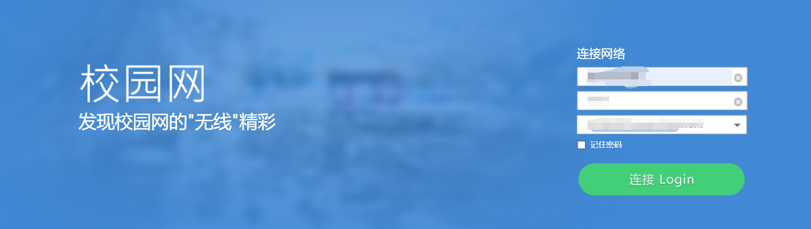

## 1. About Connect-School-Net

学校使用的校园网络是锐捷认证，通过网页认证的方式。这个软件是该情况下进行编写的。

因为每个学校的情况不同，无法做到真正的通用。以我目前使用的校园网络为例。

如图:

### About  version

V1.x版本，如果你学校的校园网属于网页认证方式，基本可以使用。

V2.x版本，针对网页认证时出现**“当前使用的源IP与设备重定向地址中用户IP不一致”**的情况，进行处理。针对锐捷网页认证。

## 2. Configuration before you start your work

锐捷网页认证本质是通过客户端发送一个post请求，以识别客户端的身份。

发送post请求需要: url地址，请求头(header)，表单数据(label_data)。

这些数据可以分析数据包获得。

### Steps

1. 打开校园网网页认证的页面，输入账号，密码，选择好相应的服务。
   - 
2. 一切准备就绪后，按键盘的**F12**打开**开发者工具**，选择**网络**,选择**保留日志**。
   - 
3. 认证页面上点击登录。
   - 
4. 寻找相应的数据包，并且记录 url地址，请求头，表单数据、
   - 
   - 
   - 
5. 最终，将url地址放到url.txt，请求头放到header.txt，表单数据放到label-data.txt。

## 3. Demo

1. 用户需要将该仓库下载到自己的计算机上。
2. 根据自己的需求，取出仓库对应版本的**Connect-School-Net.exe**，并将仓库下的data文件夹。一并放到新的文件夹中(自己命名)，组成一个软件包。
   - 
3. 配置data文件夹的文件。
4. 执行**Connect-School-Net.exe**。
   - Windows按住键盘的**Shift + 鼠标右键**，选择打开**PowerShell**窗口(也可以使用cmd)。
5. 根据程序输出的结果，并且测试是否可以正常使用。
6. 一键登录
   - 将**Connect-School-Net.exe**的快捷方式放到桌面。
   - 将快捷方式存放到**C:\ProgramData\Microsoft\Windows\Start Menu**，通过按住Win键快速呼出搜索栏，输入关键字进行快速匹配和启动。

## 4. Add comments

V2.x中，为了解决**当前使用的源IP与设备重定向地址中用户IP不一致**这个问题，请将**./data/label_data.txt**(已配置好了的)**queryString**的值改为 你登录校园网使用的IP地址或者网址，切记，不要添加**http://或者https://**。

- 